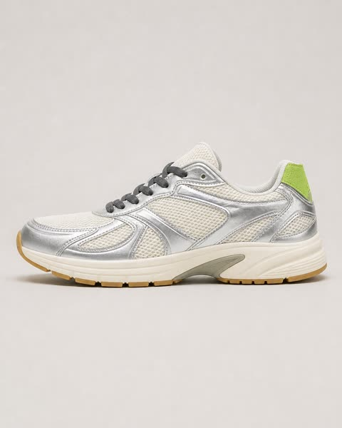
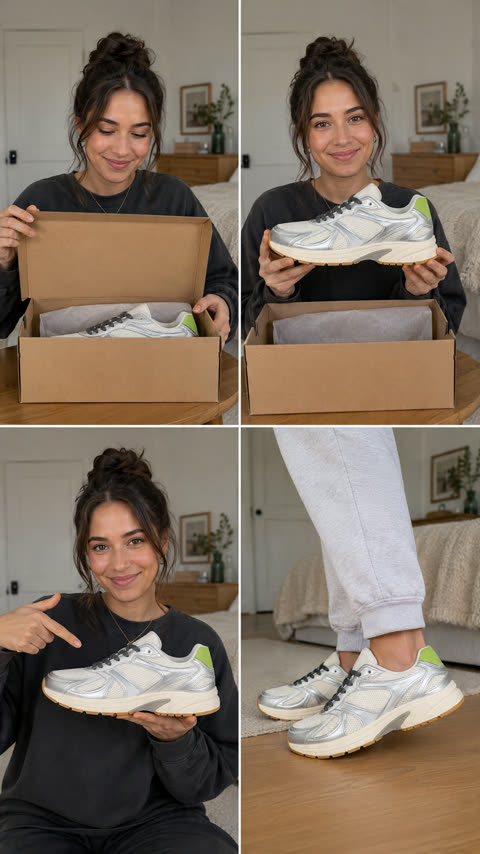
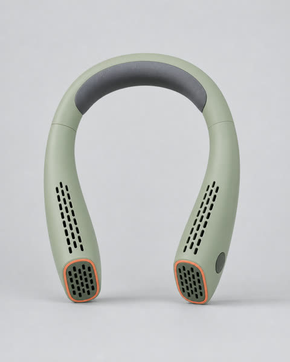
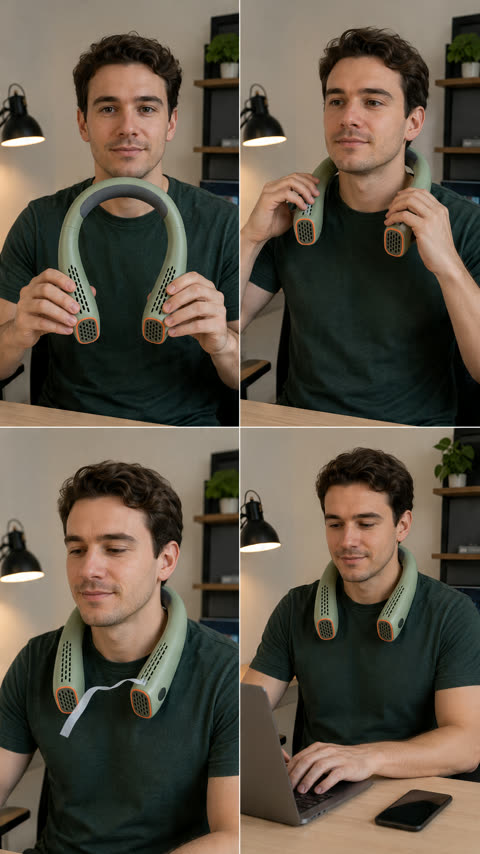
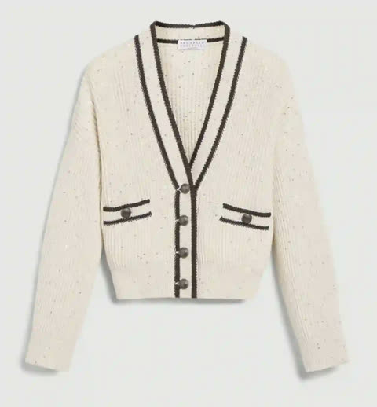
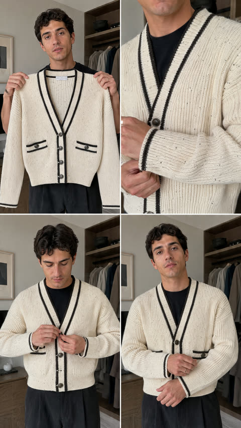

# UGC Product Video Skill

[English](README.en.md) | [简体中文](README.zh-CN.md)

A source-available, provider-neutral AI Skill for planning and reviewing truthful 15-second presenter-led UGC product videos. It turns authorized product visuals and verified facts into product-specific demonstration strategies, a four-stage visual plan, synchronized spoken performance, and final-media ASR captions.

Personal learning, research, testing, hobby projects, and other noncommercial uses are welcome. Commercial use requires separate written authorization from the project owner.

## Quick start

Install or import the folder [`ugc-product-video`](ugc-product-video/) into a compatible Skill runtime, then invoke:

```text
Use $ugc-product-video to analyze my authorized product image and verified facts, propose truthful demonstration strategies, and create a 15-second UGC product-video plan.
```

## Real showcases

These historical direct test outputs show the complete workflow from one product image to a 2×2 state sheet and then a 15-second presenter-led video. They are included as workflow evidence, not as a benchmark or a guarantee of identical output in another provider.

GitHub READMEs do not embed repository MP4 files as native video players. The third column therefore uses an inline animated preview; click it to play the complete MP4 with sound and browser controls.

### Shoe · unboxing to on-foot result

The sequence moves from a product-only reference to four planned states: unboxing, close presentation, detail proof, and an on-foot ending.

<table>
  <tr><th>1 · Product image</th><th>2 · 2×2 state sheet</th><th>3 · Final video</th></tr>
  <tr>
    <td><a href="showcase/shoe/product.jpg"></a></td>
    <td><a href="showcase/shoe/anchor-sheet.png"></a></td>
    <td><a href="https://cdn.jsdelivr.net/gh/JimmyJiang967/ugc-product-video-skill@main/showcase/shoe/final-video.mp4"></a><br><a href="https://cdn.jsdelivr.net/gh/JimmyJiang967/ugc-product-video-skill@main/showcase/shoe/final-video.mp4">Play the full video with sound</a></td>
  </tr>
</table>

### Wearable device · wear state and restrained effect proof

When a function is confirmed but the control is not visible, the plan avoids inventing a button press and demonstrates the worn state plus a modest airflow proxy.

<table>
  <tr><th>1 · Product image</th><th>2 · 2×2 state sheet</th><th>3 · Final video</th></tr>
  <tr>
    <td><a href="showcase/wearable-device/product.png"></a></td>
    <td><a href="showcase/wearable-device/anchor-sheet.png"></a></td>
    <td><a href="https://cdn.jsdelivr.net/gh/JimmyJiang967/ugc-product-video-skill@main/showcase/wearable-device/final-video.mp4"></a><br><a href="https://cdn.jsdelivr.net/gh/JimmyJiang967/ugc-product-video-skill@main/showcase/wearable-device/final-video.mp4">Play the full video with sound</a></td>
  </tr>
</table>

### Cardigan · garment detail to worn result

The product image is translated into a lived-in wardrobe sequence that preserves visible garment details and ends in an actual worn state without claiming unverified material or comfort properties.

<table>
  <tr><th>1 · Product image</th><th>2 · 2×2 state sheet</th><th>3 · Final video</th></tr>
  <tr>
    <td><a href="showcase/cardigan/product.png"></a></td>
    <td><a href="showcase/cardigan/anchor-sheet.png"></a></td>
    <td><a href="https://cdn.jsdelivr.net/gh/JimmyJiang967/ugc-product-video-skill@main/showcase/cardigan/final-video.mp4"></a><br><a href="https://cdn.jsdelivr.net/gh/JimmyJiang967/ugc-product-video-skill@main/showcase/cardigan/final-video.mp4">Play the full video with sound</a></td>
  </tr>
</table>

See [showcase/README.md](showcase/README.md) for provenance, limitations, and separate media-rights terms. Permission to view the Showcase does not grant reuse rights to depicted products, trademarks, packaging, voices, or likenesses.

## License and commercial use

The software and documentation in the current version are licensed under the [PolyForm Noncommercial License 1.0.0](LICENSE).

You may use and modify the project for personal learning, research, testing, hobby projects, and other noncommercial purposes. You must obtain separate written authorization before using it for client work, paid services, commercial content production, advertising, affiliate or sales activity, batch monetization, internal business operations, SaaS or product integration, or resale.

See [COMMERCIAL_LICENSE.md](COMMERCIAL_LICENSE.md) for practical examples and the commercial-authorization route. This is a source-available project, not an OSI-approved open-source project.

This project is not affiliated with or endorsed by CapCut, Xiaohongshu, TikTok, or any video-generation provider.
